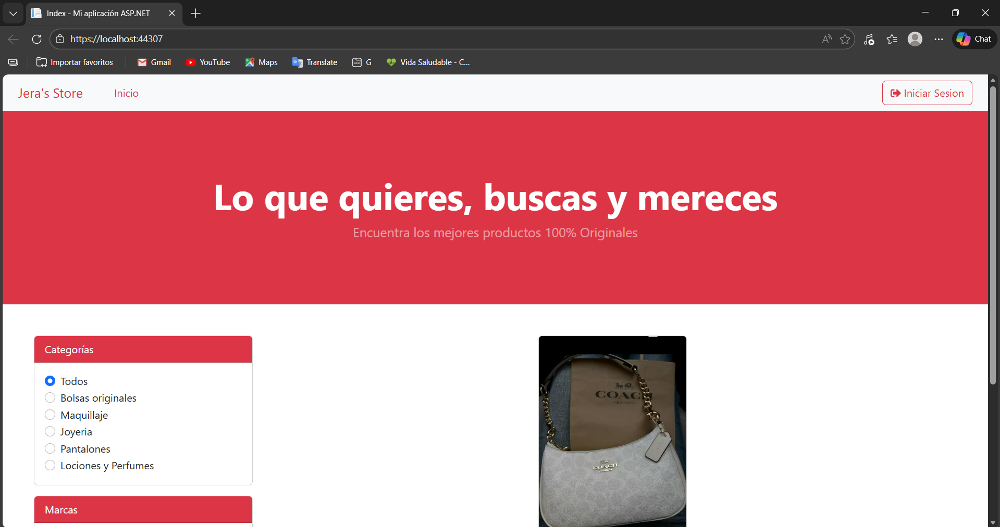
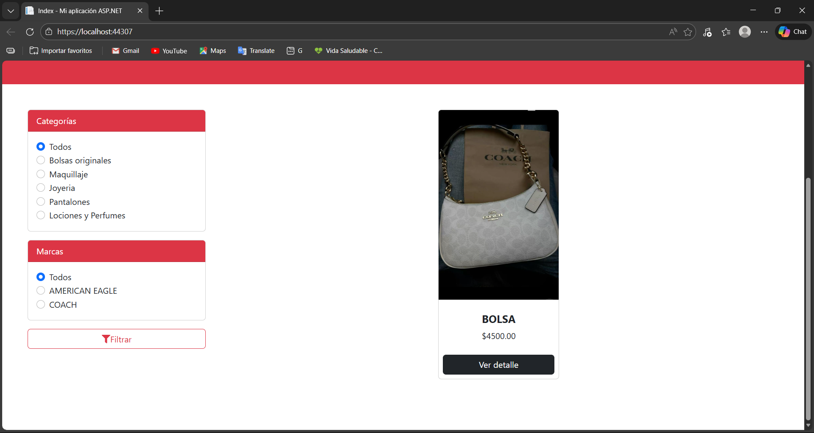
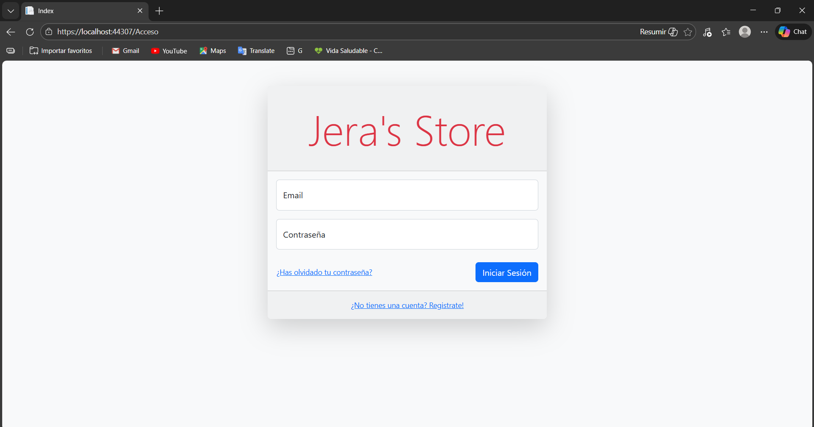
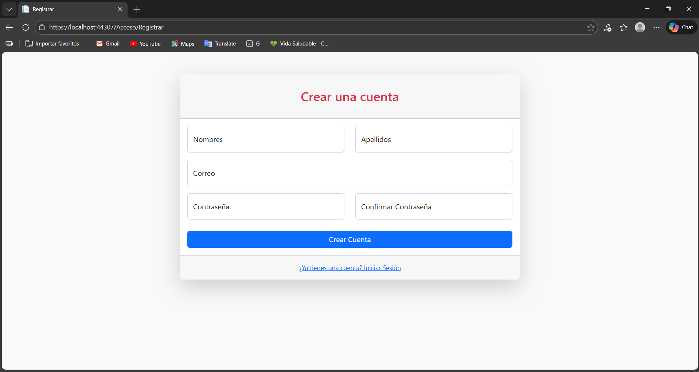
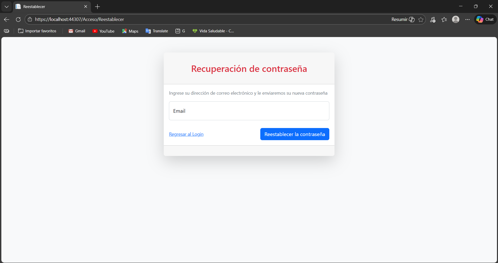
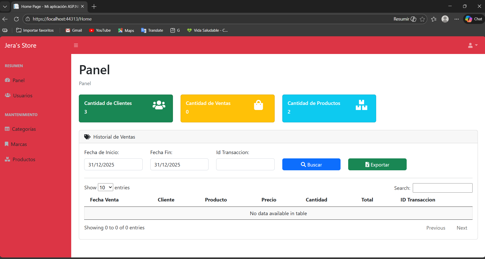
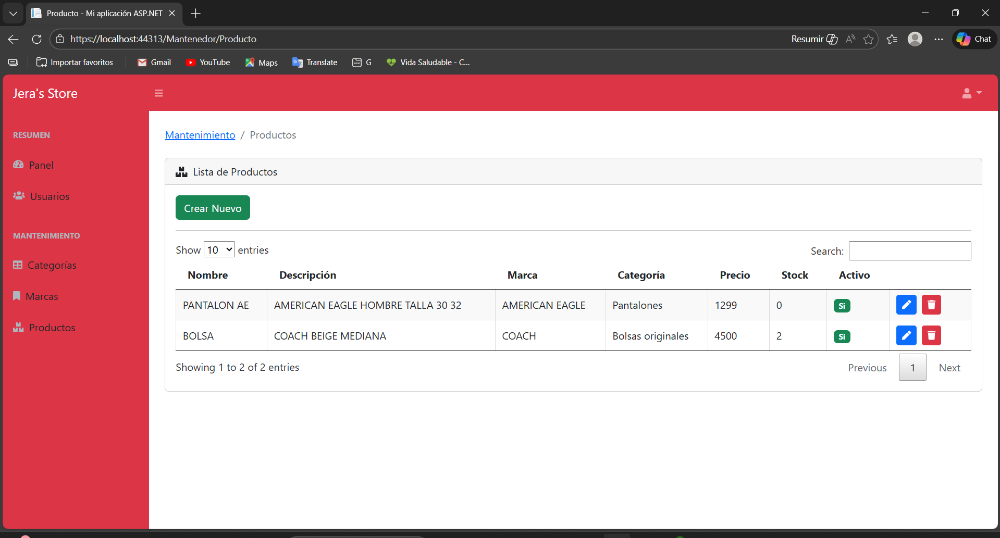
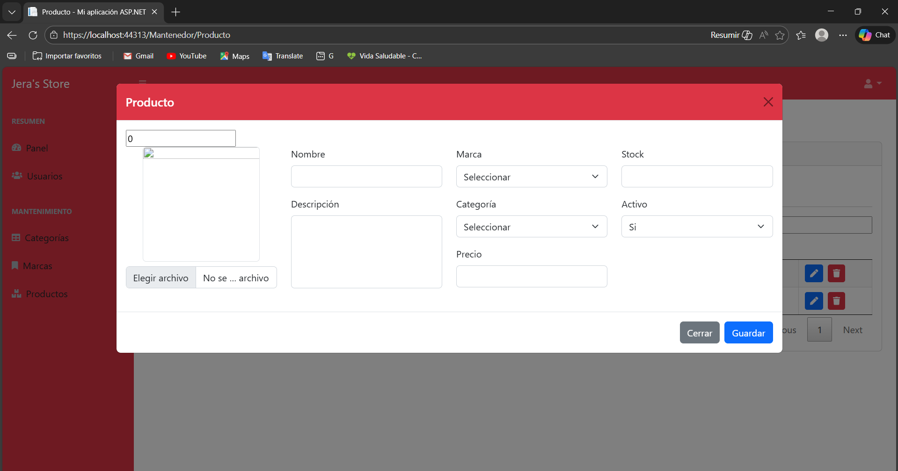

# JERA-STORE 🛒

## 📌 Descripción
JERA-STORE es una aplicación web tipo tienda (e-commerce) desarrollada como proyecto académico, cuyo propósito es simular el funcionamiento de una tienda en línea mediante una arquitectura organizada por capas.

El sistema aplica principios de Ingeniería de Software como la separación de responsabilidades, la lógica de negocio y el acceso a datos, permitiendo una mejor organización, mantenimiento y escalabilidad del proyecto.

---

## 🎯 Objetivo del proyecto
Desarrollar una aplicación estructurada que permita poner en práctica los siguientes conceptos:

- Arquitectura por capas
- Desarrollo web con HTML, CSS y JavaScript
- Implementación de lógica de negocio
- Uso de consultas SQL
- Trabajo colaborativo y control de versiones con GitHub

---

## 🛠️ Tecnologías utilizadas
- **HTML** – Estructura de la interfaz
- **CSS** – Diseño y estilos
- **JavaScript** – Lógica del frontend
- **C# (.NET)** – Backend y arquitectura por capas
- **SQL Server** – Base de datos
- **Git & GitHub** – Control de versiones

---

## 🧱 Arquitectura del sistema
El proyecto está organizado utilizando una **arquitectura por capas**, lo cual permite separar claramente las responsabilidades del sistema.

### Capas del proyecto:
- **CapaEntidad**: Define las entidades o modelos del sistema.
- **CapaDatos**: Encargada del acceso a la base de datos y ejecución de consultas SQL.
- **CapaNegocio**: Contiene la lógica del sistema.
- **CapaPresentacionAdmin**: Interfaz para la administración del sistema.
- **CapaPresentacionTienda**: Interfaz principal de la tienda para el usuario.
- **CONSULTAS SQL**: Scripts para la creación y manejo de la base de datos.

### 📁 Estructura del repositorio

---

## ⚙️ Funcionalidades principales
- Visualización de productos en la tienda
- Organización del sistema mediante arquitectura por capas
- Separación entre lógica, datos y presentación
- Uso de consultas SQL para el manejo de información
- Interfaz diferenciada para administración y tienda

---

## 🗄️ Base de datos
El sistema utiliza **SQL Server** como gestor de base de datos.

📌 Dentro del repositorio se incluyen scripts SQL en la carpeta `CONSULTAS SQL` para:
- Creación de tablas
- Inserción de datos
- Consultas necesarias para el funcionamiento del sistema

> **Nota:** No se incluyen credenciales ni cadenas de conexión reales por motivos de seguridad.

---

## 🤝 Trabajo en equipo
Proyecto desarrollado en **equipo** como parte de actividades académicas.

### Mi aportación
- Participación en el desarrollo de la lógica del sistema.
- Implementación de funcionalidades dentro de las distintas capas.
- Apoyo en la organización de la arquitectura por capas.
- Elaboración y revisión de consultas SQL.
- Uso de GitHub para control de versiones y trabajo colaborativo.

---

## 📸 Capturas del sistema
A continuación se muestran algunas capturas del diseño y funcionamiento de la aplicación JERA-STORE.

### 🏠 Pantalla de inicio

### 🔐 Inicio de sesión

### 📝 Crear cuenta

### 🔑 Recuperación de contraseña

### 🛠️ Panel de administración

